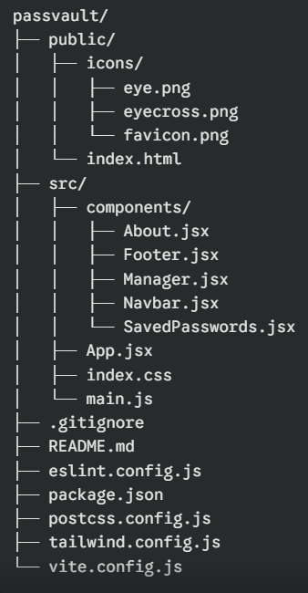

# PassVault - Your Own Password Manager

In today's digital world, remembering and managing multiple passwords can be a daunting task. That's where PassVault comes in.

## Our Mission
We believe that password management should be effortless and secure. PassVault is designed to simplify your digital life by:

- Securely store all your passwords in one convenient location.
- Quickly and easily retrieve any password with a single click.
- Generate strong, unique passwords for each of your accounts.
- Employ robust encryption to protect your sensitive information.
- Store your data securely on your device, giving you complete control.

## Why Choose PassVault?

- **Simplicity**: Our user-friendly interface makes password management a breeze.
- **Security**: Your data is protected with the latest encryption technologies.
- **Privacy**: We respect your privacy and do not store any of your data on our servers.
- **Convenience**: Access your passwords anytime, anywhere, from any device.
- **Free to Use**: PassVault is available for free, with no hidden costs.

## App Structure

## Installation
### Prerequisites:
Make sure you have Node.js and npm installed.
1.	Clone the repository:
` git clone https://github.com/Arnav10090/PassVault.git `
` cd PassVault `

2.	Install dependencies:
` npm install `

3.	Start the development server:
` npm run dev `
