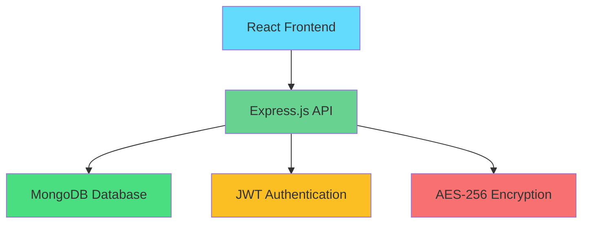

<div align="center">

# 🔐 PassVault

### *Your Trusted Digital Security Partner*

[](https://opensource.org/licenses/MIT)
[](https://nodejs.org/)
[](https://reactjs.org/)
[](https://www.mongodb.com/)
[](https://vitejs.dev/)

*Secure • Simple • Powerful*

[🚀 Live Demo](https://passvault-demo.com) • [📖 Documentation](https://docs.passvault.com) • [🐛 Report Bug](https://github.com/Arnav10090/PassVault/issues) • [💡 Request Feature](https://github.com/Arnav10090/PassVault/issues)

</div>

---

## 🌟 Overview

In today's digital landscape, managing multiple passwords securely is more critical than ever. **PassVault** is a cutting-edge password manager that combines military-grade encryption with an intuitive user experience, giving you complete control over your digital security.

<div align="center">

### 🎯 **Why PassVault?**

| Feature | Description |
|---------|-------------|
| 🛡️ **Zero-Knowledge Architecture** | Your data is encrypted locally - we never see your passwords |
| 🎨 **Modern UI/UX** | Beautiful, responsive design with smooth animations |
| ⚡ **Lightning Fast** | Built with React + Vite for optimal performance |
| 🔒 **Military-Grade Encryption** | AES-256 encryption keeps your data secure |
| 🌐 **Cross-Platform** | Works seamlessly across all devices |
| 💰 **100% Free** | No hidden costs, no premium tiers |

</div>

---

## 📸 Screenshots

<div align="center">

### 🏠 **Home Page**


### 🔐 **Password Manager**


### 📱 **Mobile Responsive**


</div>

---

## 🚀 Quick Start

### 📋 Prerequisites

Before you begin, ensure you have the following installed:

-  [Download Node.js](https://nodejs.org/)
-  [Download MongoDB](https://www.mongodb.com/try/download/community)
-  [Download Git](https://git-scm.com/)

### ⚡ Installation

<details>
<summary><b>🖥️ Frontend Setup</b></summary>

```bash
# Clone the repository
git clone https://github.com/Arnav10090/PassVault.git
cd PassVault

# Install dependencies
npm install

# Start development server
npm run dev
```

Your frontend will be running at `http://localhost:5173` 🎉

</details>

<details>
<summary><b>🔧 Backend Setup</b></summary>

```bash
# Navigate to backend directory
cd backend

# Install dependencies
npm install

# Create environment file
cp .env.example .env

# Edit .env with your configuration
nano .env
```

**Environment Variables:**
```env
MONGODB_URI=mongodb://localhost:27017/passvault
PORT=5000
ENCRYPTION_KEY=your-super-secret-key-change-this-immediately
NODE_ENV=development
JWT_SECRET=your-jwt-secret-key
```

```bash
# Start backend server
npm run dev
```

Your backend will be running at `http://localhost:5000` 🚀

</details>

---

## 🏗️ Architecture

<div align="center">



</div>

### 🛠️ Tech Stack

<div align="center">

| Frontend | Backend | Database | Security |
|----------|---------|----------|----------|
|  |  |  |  |
|  |  |  |  |
|  |  | |  |

</div>

---

## ✨ Features

<div align="center">

### 🔐 **Security First**
- **AES-256 Encryption** - Military-grade security
- **Zero-Knowledge Architecture** - We never see your data
- **Secure Password Generation** - Create unbreakable passwords
- **JWT Authentication** - Secure session management

### 🎨 **Beautiful Design**
- **Modern UI/UX** - Intuitive and elegant interface
- **Dark/Light Theme** - Choose your preferred style
- **Responsive Design** - Perfect on any device
- **Smooth Animations** - Delightful user interactions

### ⚡ **Performance**
- **Lightning Fast** - Built with Vite for optimal speed
- **Real-time Sync** - Instant updates across devices
- **Offline Support** - Access your passwords anywhere
- **Optimized Bundle** - Minimal loading times

### 🛠️ **Developer Friendly**
- **RESTful API** - Easy integration and extensibility
- **Comprehensive Documentation** - Get started quickly
- **TypeScript Support** - Type-safe development
- **Modern Tooling** - ESLint, Prettier, and more

</div>

---

## 📚 API Documentation

<details>
<summary><b>🔗 Authentication Endpoints</b></summary>

| Method | Endpoint | Description |
|--------|----------|-------------|
| `POST` | `/api/auth/register` | Register new user |
| `POST` | `/api/auth/login` | User login |
| `POST` | `/api/auth/logout` | User logout |
| `GET` | `/api/auth/me` | Get current user |

</details>

<details>
<summary><b>🔐 Password Endpoints</b></summary>

| Method | Endpoint | Description |
|--------|----------|-------------|
| `GET` | `/api/passwords` | Get all passwords |
| `POST` | `/api/passwords` | Create new password |
| `PUT` | `/api/passwords/:id` | Update password |
| `DELETE` | `/api/passwords/:id` | Delete password |
| `GET` | `/api/passwords/generate` | Generate secure password |

</details>

---

## 🤝 Contributing

We love contributions! Here's how you can help make PassVault even better:

<div align="center">

### 🌟 **Ways to Contribute**

| Type | Description |
|------|-------------|
| 🐛 **Bug Reports** | Found a bug? Let us know! |
| 💡 **Feature Requests** | Have an idea? We'd love to hear it! |
| 📝 **Documentation** | Help improve our docs |
| 🔧 **Code** | Submit a pull request |

</div>

<details>
<summary><b>📋 Contribution Guidelines</b></summary>

1. **Fork the repository**
2. **Create a feature branch**: `git checkout -b feature/amazing-feature`
3. **Commit your changes**: `git commit -m 'Add amazing feature'`
4. **Push to the branch**: `git push origin feature/amazing-feature`
5. **Open a Pull Request**

</details>

---

## 📄 License

This project is licensed under the **MIT License** - see the [LICENSE](LICENSE) file for details.

---

## 🙏 Acknowledgments

<div align="center">

### 💝 **Special Thanks**

- **React Team** - For the amazing framework
- **MongoDB** - For the powerful database
- **Tailwind CSS** - For the beautiful styling
- **Lucide Icons** - For the gorgeous icons
- **All Contributors** - For making this project better

</div>

---

<div align="center">

### 🌟 **Star History**

[](https://star-history.com/#Arnav10090/PassVault&Date)

---

### 📞 **Get in Touch**

[](https://github.com/Arnav10090)
[](https://x.com/passvault)
[](https://www.youtube.com/channel/UCP58uS7v_Iedv9LTu0R74iQ)
[](mailto:contact@passvault.com)

---

**Made with ❤️ by [Arnav Tiwari](https://github.com/Arnav10090)**

*Securing your digital life, one password at a time.*

</div>

